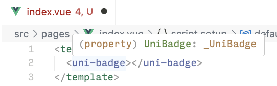

# @uni-helper/uni-ui-types

<div style="display: flex; justify-content: center; align-items: center; gap: 8px;">

[](https://github.com/uni-helper/uni-typed/blob/main/LICENSE)

[](https://www.npmjs.com/package/@uni-helper/uni-ui-types)

[](https://www.npmjs.com/package/@uni-helper/uni-ui-types)

</div>

- [@uni-helper/uni-app-types](https://github.com/uni-helper/uni-typed/tree/main/packages/uni-app-types) 为 Vue v3 uni-app 组件提供 TypeScript 类型。
- [@uni-helper/uni-cloud-types](https://github.com/uni-helper/uni-typed/tree/main/packages/uni-cloud-types) 为 Vue v3 uni-cloud 组件提供 TypeScript 类型。
- 【当前】[@uni-helper/uni-ui-types](https://github.com/uni-helper/uni-typed/tree/main/packages/uni-ui-types) 为 Vue v3 uni-ui 组件提供 TypeScript 类型。
- [@uni-helper/uni-types](https://github.com/uni-helper/uni-typed/tree/main/packages/uni-types) 为 Vue v3 uni-app、uni-cloud 和 uni-ui 组件提供 TypeScript 类型支持，即以上三者的集合。

## 起步

### 配置编辑器/IDE

请参考 [搭配 TypeScript 使用 Vue](https://cn.vuejs.org/guide/typescript/overview.html) 将 Volar（Vue 语言服务工具）添加到你的编辑器或 IDE，配置完毕后请重启你的编辑器或 IDE 以确保服务启动。

> [!TIP]
> 截至 2024-08-07，经实测确定，版本组合 Volar v2.0.28、TypeScript v5.5.4、Vue v3.4.38 可正常实现类型提示。

### 安装依赖

```shell
npm i -D @uni-helper/uni-ui-types
```

此外你需要确保项目已经安装 Vue 和 TypeScript。

> [!TIP]
> 为了避免幽灵依赖（又称幻影依赖，详见 [这篇文章](https://rushjs.io/zh-cn/pages/advanced/phantom_deps/)），请检查你的包管理器。
>
> 如果你正在使用 yarn v2 或以上版本，请参考 [文档](https://yarnpkg.com/configuration/yarnrc/#nodeLinker) 设置 `nodeLinker` 为 `node_modules`。
>
> 如果你正在使用 pnpm，请参考 [文档](https://pnpm.io/npmrc#shamefully-hoist) 设置 `shamefully-hoist` 为 `true`。

### 配置 TypeScript

更新 `tsconfig.json`，确保：

- `compilerOptions.types` 包含 `@uni-helper/uni-ui-types`
- `include` 包含 `vue` 相关文件

以下是一个 `tsconfig.json` 示例，你可以直接复制它并粘贴到项目内。请注意，你可能需要稍微调整以匹配你的开发需求，相关依赖需要自行安装。

> [!WARNING]
> 截至 2026-05-09，uni-app 官方提供的 Vue v3 + Vite + TypeScript 模板版本相对落后，如果你正在使用它，请手动升级 TypeScript 和 Vue 版本，[playground/package.json](https://github.com/uni-helper/uni-typed/blob/main/playground/package.json) 可供参考。
>
> 你也可以在这里获取 [社区模板](https://github.com/uni-helper/awesome-uni-app#%E6%A8%A1%E6%9D%BF) 以起步。

```jsonc
{
  "compilerOptions": {
    "lib": ["DOM", "DOM.Iterable", "ESNext"],
    "module": "ESNext",
    "moduleResolution": "bundler",
    "resolveJsonModule": true,
    "jsx": "preserve",
    "jsxImportSource": "vue",
    "noImplicitThis": true,
    "strict": true,
    "verbatimModuleSyntax": true,
    "target": "ESNext",
    "useDefineForClassFields": true,
    "esModuleInterop": true,
    "forceConsistentCasingInFileNames": true,
    "skipLibCheck": true,
    "types": [
      // uni-app + Vue 3 使用 Vite 构建，需要安装 vite
      "vite/client",
      // uni API 相关的 TypeScript 类型
      "@dcloudio/types",
      // my API 相关的 TypeScript 类型
      "@mini-types/alipay",
      // wx API 相关的 TypeScript 类型，需要手动安装依赖
      "miniprogram-api-typings",
      // 为 uni-ui 组件提供 TypeScript 类型
      "@uni-helper/uni-ui-types"
    ]
  },
  "include": ["src/**/*.ts", "src/**/*.d.ts", "src/**/*.tsx", "src/**/*.vue", "*.d.ts"]
}
```

再次重启你的编辑器或 IDE 以确保服务启动并正确加载配置。如果一切顺利，你应该可以看到类似的 TypeScript 类型提示。



## 使用

### Template

自动为 Template 内对应组件附加 TypeScript 类型提示。


### Script

推荐使用 `@uni-helper/uni-ui-types` 导出的 TypeScript 类型为变量标注类型。

```vue
<script setup lang="ts">
import { ref } from 'vue';
import type { UniBadgeType, UniBadgeOnClick } from '@uni-helper/uni-ui-types';

const type = ref<UniBadgeType>('default');
const onClick: UniBadgeOnClick = (event) => {
  // ...
};
</script>

<template>
  <uni-badge :type="type" @click="onClick"></uni-badge>
</template>
```

也可以直接使用命名空间来为变量标注类型（不推荐，详见 [typescript-eslint - no-namespace](https://typescript-eslint.io/rules/no-namespace/))。

```vue
<script setup lang="ts">
import { ref } from 'vue';

const type = ref<UniHelper.UniBadgeType>('default');
const onClick: UniHelper.UniBadgeOnClick = (event) => {
  // ...
};
</script>

<template>
  <uni-badge :type="type" @click="onClick"></uni-badge>
</template>
```

## FAQ

### Vue 2 支持情况

如果你正在使用 Vue 2、需要组件 TypeScript 类型支持，请使用 Volar v2.0.21、@uni-helper/uni-ui-types v0.5 和 TypeScript v5.4.5，这是最后已知可用的版本组合。

> [👉 点击获取 Volar v2.0.21 VS Code Extension](../../assets/Vue.volar-2.0.21.vsix)

如果你正在使用 Vue 2、无需组件 TypeScript 类型支持，请使用 [Vetur](https://github.com/vuejs/vetur) 和 [@dcloudio/uni-helper-json](https://www.npmjs.com/package/@dcloudio/uni-helper-json)。

> [!WARNING]
> Volar 和 Vetur 不可共存，请只启用其中一个。

### 类型不正确

该项目强依赖 Volar、TypeScript 和 Vue 内部类型和处理，更改内部类型和处理不会对使用者造成破坏性更新，但可能会对开发者造成破坏性更新，对因此更新三者任一依赖后，可能无法正常显示本身是 HTML 自带但被占用的元素的 TypeScript 类型（如 SVG 相关元素 view、image、text、输入框元素 input 等），我们强烈建议锁定依赖版本以避免类似问题。如果你遇到了类似的问题，请先回退并锁定版本，并在 QQ 群内反馈、微信群内反馈、提交 ISSUE 或 PR，我们将尽快处理，非常感谢你的帮助！🙏

### 类型与文档冲突或

类型与官方文档的冲突之处，请以官方文档为准，并在 QQ 群内反馈、微信群内反馈、提交 ISSUE 或 PR，我们将尽快处理，非常感谢你的帮助！🙏

## 致谢

最初在 [uni-base-components-types](https://github.com/satrong/uni-base-components-types) 得到了灵感。

基于 [这个 PR](https://github.com/satrong/uni-base-components-types/pull/5) 完成。

## 赞助

如果这个包对你有所帮助，请考虑 [赞助](https://github.com/ModyQyW/sponsors) 支持。

<p align="center">
  <a href="https://cdn.jsdelivr.net/gh/ModyQyW/sponsors/sponsorkit/sponsors.svg">
    
  </a>
</p>
